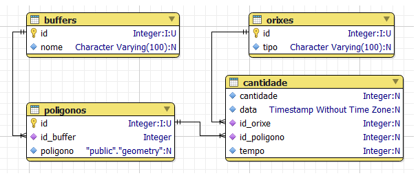

# CLEANATLANTIC
All the code of CleanAtlantic developed by INTECMAR

AIM:
----
The main goal of these programs is to count the beaching particles of the outputs of MOHID Langrangian model (old version) and insert in segments of coastlines. These segments are stored in PostGIS database.

SCRIPTS:
--------

- **hdflitter:** Count particles from a HDF5 MOHID Lagrangian file with LITTER option into
each poligon of a buffer stored in a CleanAtlantic Database, and insert the
results into the same db.
  
  
- **insertbuffer:** Insert origin, buffers and poligons reading a shapefile. It is  old fashion code

- **insertorde:** Insert a order table for some polygons of a buffer.

- **pegspeed:** Calculate the velocity of a peg, and the velocitiy from a MOHID Hydrodynamic
  output on the peg spots, and save the results in csv and xlsx format
  

- **windspeed:** Read a WRF output of wind and save the lefdown node matching the locations
  from a CSV file.
  

- **cleanatlantic:** Some libs for deal with buffers and partics, read mohid hdf files,
  and find ij from a lat, lon position
  

- **stuff:** Folder with old code

MORE:
-----

In order to use these scripts, some previous requirements must be done:

1) A former version MOHID Lagrangian model output with LITTER option ON is needed. 
   The scripts will count the beached particles from this output. More information in 
   www.mohid.com
   
2) A PostGIS Database with the next schema:

- __buffers:__ A buffer means a set of polygons for a segmented coastline
  - _nome_ name
    
- __poligonos:__ (_polygons_) Each polygon belongs to a buffer.
  - _id_buffer_: foreign key of buffers table
  - _poligono_: geometry of a polygon
  
- __cantidade:__ (_ammount_): Amount of pilled-up particles
  - _cantidade_: Integer with the amount of pilled-up particles
  - _data_: Datetime
  - _id_orixe_: Foreign key of origin
  - _id_poligono_: Foreign key of polygon
  - _tempo_: Pilled-up duration hours
  
- __orixes__: (_origins_): reference to the simulation
  - _tipo_: Name of the origin (simulation) of the particles.
  
  
3) A shapefile with the polygons of a buffer regarding to a segmentated coastline. This shape will be inserted 
into the PostGIS database using __insertbuffer__ script.